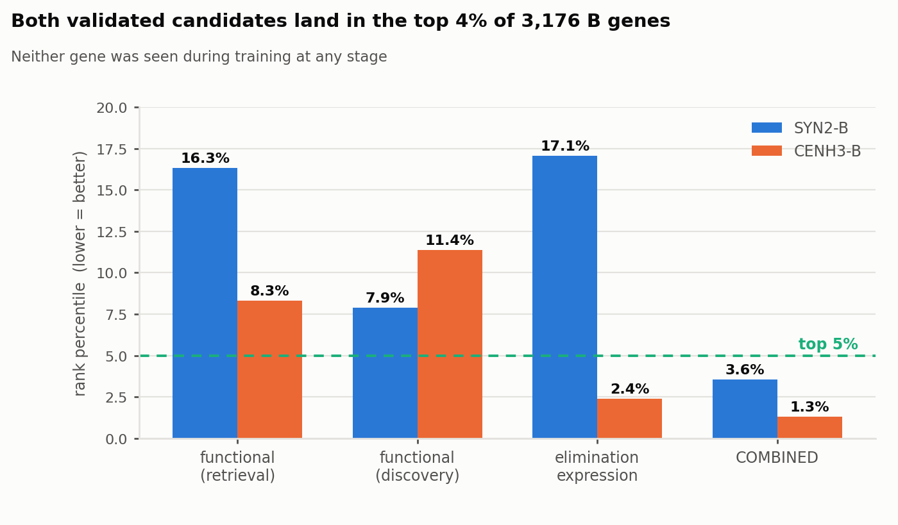
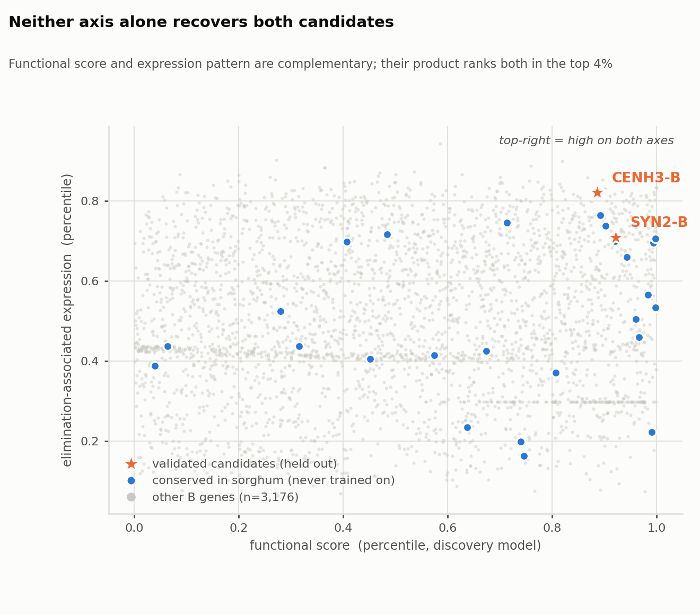
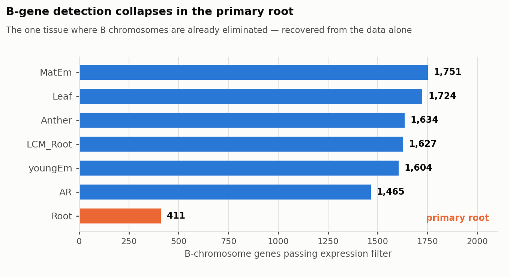
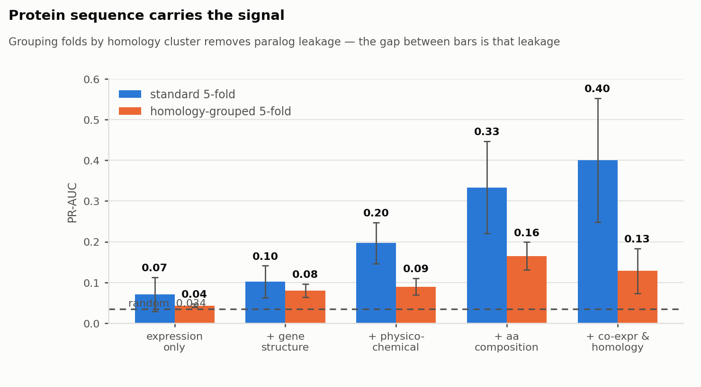

# ML-based candidate gene prioritization on a B chromosome

**Can a machine-learning ranker independently rediscover the genes I found by manual curation during my PhD?**

This repository re-approaches a published candidate-gene discovery problem as a
learning-to-rank task. Two genes; `SYN2-B` (a cohesin α-kleisin) and `CENH3-B`
(a centromeric histone variant) were nominated by stepwise manual filtering of
multi-omics data and then validated experimentally. Here they are **removed from
training entirely** and the question is whether an unbiased model puts them back
on top.

It does: both land in the **top 4% of 3,176 B-chromosome genes**.

---

## Result in one figure



| Scoring scheme | SYN2-B | CENH3-B |
|---|---|---|
| Functional model — retrieval mode | top 16.3% | top 8.3% |
| Functional model — discovery mode | top 7.9% | top 11.4% |
| Elimination-associated expression | top 17.1% | top 2.4% |
| **Product of the two axes** | **top 3.6%** | **top 1.3%** |

Neither axis alone recovers both genes. `SYN2-B` is strong on function and weak
on expression; `CENH3-B` is the reverse. Their product recovers both - which is
the same logic the original manual analysis used (GO relevance ∩ elimination-specific
expression), reproduced structurally rather than by hand-tuned filtering.



---

## Biological system

*Aegilops speltoides* is a wild relative within the wheat gene pool. It carries
**B chromosomes** - supernumerary chromosomes that are programmed to be eliminated
from root tissue during development while being retained in shoots and driven
through the male germline.

The dataset: 42 RNA-seq libraries, 7 tissues, plants with (+B) and without (0B)
B chromosomes, against a chromosome-scale PacBio HiFi assembly in which 3,176
genes are B-encoded.

**The data reproduces the biology unprompted.** Counting how many B genes survive
an expression filter in each tissue recovers the elimination phenotype with no
supervision at all:



---

## Method

**Universe.** 3,176 B-encoded genes.

**Labels.** Positives (n=80) are B genes annotated with chromosome-segregation GO
terms (cohesin, kinetochore, centromere, mitotic division). Negatives (n=2,291)
are B genes with GO annotation from other categories. Genes with no annotation are
unlabeled and ranked, never used for training. **`SYN2-B` and `CENH3-B` are masked
out of the label set completely.**

**Features (111).** Expression across 7 tissues × 2 genotypes (log-TPM, tissue
specificity τ, elimination-vs-non-elimination contrasts, per-tissue edgeR logFC/FDR);
gene structure from the GTF; protein physicochemistry and amino-acid composition;
and two fold-local features described below.

**Leak-free fold-local features.** Guilt-by-association (mean co-expression with the
positive seed set) and guilt-by-homology (best DIAMOND bitscore to a positive) are
both *label-derived*. They are recomputed inside every CV fold using only that fold's
training positives. Computing them once on the full label set -the common shortcut-
leaks the answer.

**Model.** `HistGradientBoostingClassifier`, class-balanced, scored by PR-AUC
(prevalence is 3.4%, so accuracy and ROC-AUC both flatter).

### Two CV schemes, deliberately

```
standard 5-fold          paralogs of a training positive may sit in the test fold
homology-grouped 5-fold  folds split on connected components of the DIAMOND graph
```

The gap between them is paralog leakage, and it is large.



| Feature set | standard PR-AUC | grouped PR-AUC |
|---|---|---|
| Expression only | 0.07 | 0.04 |
| + gene structure | 0.10 | 0.08 |
| + physicochemical | 0.20 | 0.09 |
| + aa composition | 0.33 | **0.16** |
| + co-expression & homology | **0.40** | 0.13 |

*(random baseline PR-AUC = 0.034)*

Two things fall out of this table:

1. **Protein sequence, not expression, carries the signal.** Expression alone is
   barely 2× random. Sequence composition takes it to 0.33.
2. **Homology features help retrieval and hurt discovery.** They lift standard CV
   (0.33 → 0.40) but *lower* grouped CV (0.16 → 0.13). Similarity to a known gene is
   useful for finding that gene's relatives and actively misleading when the target
   is a family you have never seen.

So the pipeline ships two modes rather than one number:

| Mode | Features | PR-AUC | vs random |
|---|---|---|---|
| **Retrieval** - find relatives of known genes | all, incl. homology | 0.398 ± 0.129 | 11.8× |
| **Discovery** - find novel families | homology excluded | 0.168 ± 0.047 | 5.0× |

---

## Independent validation

The held-out recovery of `SYN2-B` and `CENH3-B` is the primary test, but it is
n=2. Two orthogonal checks:

**Cross-species conservation.** 26 B genes are conserved elimination candidates
shared with *Sorghum purpureosericeum*, identified in a separate study. They were
never used in training or labelling. They are enriched **3.2×** in the top 200 of
the combined ranking.

**Top-of-list coherence.** The 20 highest-ranked genes are dominated by chromosome
segregation machinery -kinesins, two kinetochore NUF2 paralogs, condensin subunit 2,
an SMC family protein, MUS81, Shugoshin-1, synaptonemal complex protein 1 -despite
the model never seeing a GO term as a feature. Full list in
[`results/top50_candidates.csv`](results/top50_candidates.csv).

---

## What this does not show

- **n=2 for the primary test.** Recovering two genes is suggestive, not proof. The
  cross-species enrichment is the more statistically meaningful signal, and it is
  modest (3.2×).
- **Grouped PR-AUC of 0.168 is a weak absolute classifier.** It is 5× random and
  useful for ranking a shortlist; it is not a decision procedure.
- **Labels are GO-derived**, so they inherit annotation-transfer bias. Poorly
  annotated gene families are systematically disadvantaged.
- **No protein language model.** ESM-2 embeddings and Pfam domain scans were the
  intended sequence representation; both were unavailable offline in the environment
  this was built in. Amino-acid composition is a weaker stand-in, and the fact that
  it works this well suggests a pLM would do better.
- **B genes only.** Extending labels to A-chromosome genes would grow the training
  set roughly tenfold and is the single highest-value next step.

---

## Repository

```
src/01_build_features.py    expression + structural features from RSEM & GTF
src/02_parse_supplementary.py  GO map + curated candidate sets from the supplementary tables
src/03_seq_features.py      protein composition; DIAMOND homology graph
src/04_model_v2.py          model, dual CV schemes, two-axis score
src/06_ablation.py          feature-group ablation
src/07_final.py             retrieval vs discovery modes, held-out recovery
src/05_interpret.py         SHAP interpretation, annotated candidate table
src/08_figures.py           figures (light and dark variants)
results/                    rankings, ablation, SHAP importances, top-50 table
```

```bash
conda env create -f env/environment.yml && conda activate geneprio
export PROJ_DIR=$PWD
./run_all.sh
```

Runs in about 20 minutes on 8 cores. For SLURM submission see `slurm/` and
[`docs/SLURM_ko.md`](docs/SLURM_ko.md).

### Documentation

- [`docs/ML_FOR_BIOINFORMATICIANS_ko.md`](docs/ML_FOR_BIOINFORMATICIANS_ko.md) — how ML differs from a bioinformatics pipeline, for wet-lab/bioinformatics readers (Korean)
- [`docs/LIBRARIES_ko.md`](docs/LIBRARIES_ko.md) — which libraries, why, and how they map to the R equivalents (Korean)
- [`docs/WALKTHROUGH_ko.md`](docs/WALKTHROUGH_ko.md) — what this does and why, from scratch (Korean)
- [`docs/SLURM_ko.md`](docs/SLURM_ko.md) — running on an HPC cluster, and the three planned extensions (Korean)

## Data

RNA-seq and genome assembly are deposited at ENA under **PRJEB106942** and
**PRJEB89395**. Derived inputs (RSEM gene matrices, GTF, TransDecoder peptides,
supplementary tables) are not redistributed here; `run_all.sh` documents the
expected layout under `data/`.

## Citation

Kim G. *et al.* Programmed chromosome elimination correlates with the overexpression
of cohesin and additional B chromosome-encoded genes in *Aegilops speltoides*.
(under review; bioRxiv preprint).
